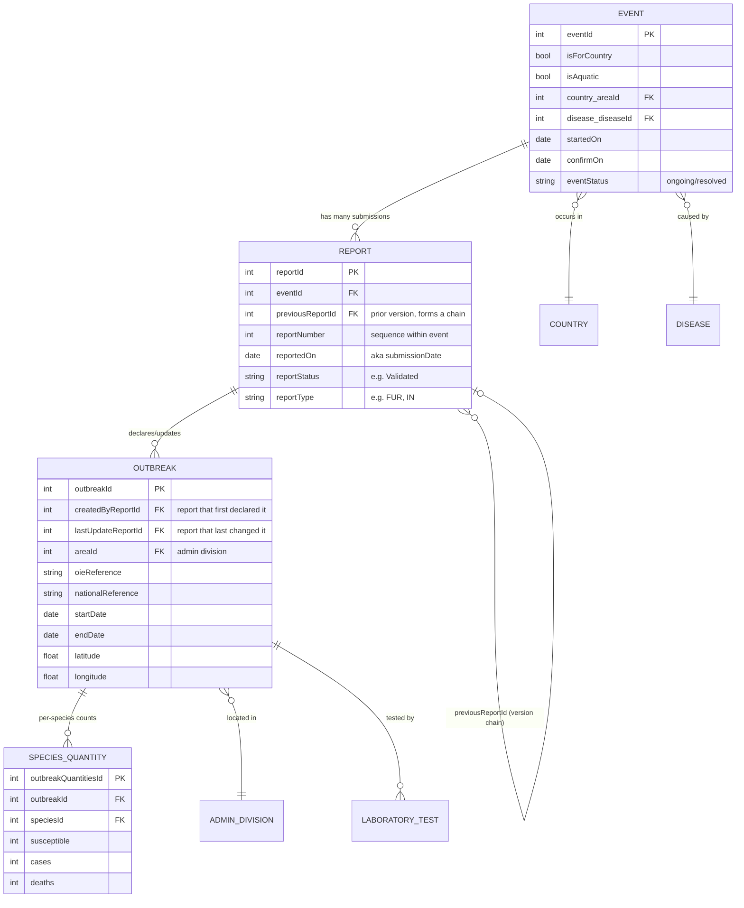

# WAHIS API data model — Event / Report / Outbreak

Source: `wahis-openapi` repo (`wahis-api-reference.md`, `wahis-openapi.yaml`),
reverse-engineered from the public WOAH WAHIS API (`pi/*` endpoints). This
document explains the three core entities and their relationships, for use
by this frontend PoC when consuming WAHIS data.

## Summary

An **Event** is the top-level disease occurrence in a country. A **Report**
is one dated submission that describes the state of an Event at a point in
time (an Event accrues many Reports over its life). An **Outbreak** is one
physical location/premises affected, attached to the Report that first
introduced it or last updated it.

```
Event (1) ──< (many) Report ──< (many) Outbreak
  |
  keyValue: eventId
  latest validated state = latest Report
```

## Entity-relationship diagram



## Key relationships and rules

1. **Event → Report: one-to-many.**
   An Event (`eventId`) is the persistent disease occurrence. Every update to
   it — a new report type, a change in status, new outbreaks — is submitted
   as a new **Report** (`reportId`) against the same `eventId`. Event 7744
   (Austria, West Nile Fever) has 10 report versions; event 6428 has 104.

2. **Report is a version, not a snapshot copy.** Reports chain via
   `previousReportId`, and `reportNumber` gives the sequence (e.g. report
   185574 is `reportNumber: 9`, `previousReportId: 185494`). The **latest**
   Report represents the current validated state of the Event. API routes
   accept either `eventId` (⇒ resolves to the latest report) or a specific
   `reportId` (⇒ that exact submission), e.g.:
   - `pi/review/event/{eventId}/all-information` — latest state
   - `pi/review/report/{reportId}/all-information` — one specific submission

3. **Report → Outbreak: one-to-many.** A Report lists the **Outbreaks**
   (physical locations/premises) it declares or updates —
   `outbreaks[]` in the `all-information` response. Each Outbreak carries
   `createdByReportId` (which report first introduced it) and
   `lastUpdateReportId` (which report last changed it) — an outbreak
   persists across many later reports without being "re-declared" each time.

4. **Outbreak is scoped to a Report+Event pair, not free-standing.** The
   detail endpoint is `pi/review/report/{reportId}/outbreak/{outbreakId}/all-information`
   — an outbreak is always looked up in the context of the report (or event)
   that surfaces it.

5. **Real-world composite key confirmed independently.** The APHA IDM
   spreadsheet pipeline (`WOAHSPOLScrapeCombined-2.xlsx`, see
   `docs/intelligence-review-poc-plan.md`) keys outbreak rows by
   `EventId + OutbreakId` composite (`ScrapeKey`/`SPOLKey`), corroborating
   that an `outbreakId` is only unique in combination with its parent event —
   consistent with the API's report/event-scoped outbreak lookup.

6. **Outbreak → Species quantities: one-to-many.** Each Outbreak has
   per-species counts (`susceptible`, `cases`, `deaths`, `killed`,
   `slaughtered`, `vaccinated`), split into `newQuantities` (this report's
   delta) and `totalQuantities` (cumulative). Units come from a separate
   `quantity-unit` lookup (e.g. "Animal") — a count of `3` may mean 3 animals
   or 3 herds depending on context; `null` means "not reported", not zero.

7. **Outbreak → Admin division: many-to-one**, via a 3-level hierarchy
   (`adminLevel` 1/2/3, chained by `parentAreaId`, rooted at the country's
   `areaId`).

8. **Event → Country / Disease: many-to-one.** Disease and country are
   carried at Event level, not Outbreak level (`outbreak.disease` is
   consistently `null` in samples — disease lives on the parent event).

## Identifier cheat-sheet

| ID | Meaning | Scope |
|---|---|---|
| `eventId` | The disease occurrence (country + disease + timeframe) | Top-level, long-lived |
| `reportId` | One dated submission/version of an event | Belongs to exactly one event |
| `previousReportId` | Link to the prior version of the same event | Forms a version chain |
| `outbreakId` | One affected location/premises | Declared/updated by a report; unique in practice as `eventId+outbreakId` |
| `outbreakQuantitiesId` | One species' count row within an outbreak | Belongs to exactly one outbreak |
| `areaId` | Country or admin-division node | Shared reference data, hierarchical |

## Endpoints that expose these relationships

| Endpoint | Relationship shown |
|---|---|
| `pi/event/filtered-list` | Event ⨯ Report summary rows (`eventId` + `reportId` per row) |
| `pi/event/{eventId}/report-evolution` | All Report versions for one Event |
| `pi/review/{report\|event}/{id}/all-information` | Event + Report + Outbreaks[] in one payload |
| `pi/review/{report\|event}/{id}/outbreaks` | Outbreak list for a Report/Event |
| `pi/review/report/{reportId}/outbreak/{outbreakId}/all-information` | One Outbreak's full detail (admin divisions, species quantities) |
| `pi/map-data/outbreaks-by-report-id` | Outbreak ⨯ Event (`outbreakId` + `eventId`) with lat/long, for one report |
| `pi/map-data/outbreaks-from-event-ids` | Outbreak ⨯ Event for a set of events |

## Open gaps / caveats

- `additionalMeasures` and `measuresNotImplemented` shapes are unconfirmed
  (empty in all samples observed).
- `outbreak.disease` is always `null` — disease is an event-level attribute.
- Ordering of evolution endpoints (`comment-evolution`,
  `control-measure-evolution`) is not stable between calls; always sort
  client-side by `reportNumber` before display.
- This frontend PoC (`docs/intelligence-review-poc-plan.md`) currently scopes
  its own MVP to **Outbreak only**, using a simplified single-field
  `OUTBREAK ID` key rather than the real `eventId+outbreakId` composite — a
  deliberate simplification, not a data-model discrepancy.
